# Genba Tasks (SPA) – ポートフォリオ

> 施工管理の**現場段取りを見える化**し、タスクを**細分化**して**優先順位**を明快にする。  
> 現場ごとの**絞り込み**で「今やるべき」を失わない、現場×PC向けのタスク管理アプリ。

- アプリ: https://app.genba-tasks.com/
- API ヘルスチェック: https://api.genba-tasks.com/up
- 体験方法: **ゲストログイン**（ワンクリック入場 / メール登録不要）

> **ゲスト環境の方針（運用予定）**
> - ゲストの全データは **毎日 AM4:00 (JST)** に初期化
> - 画像は **親タスクのみ 1枚 / ≤5MB / jpeg・png・webp・gif**、**7日で自動削除**
> - メール送信は **デモでは無効**（本番は切替可能）

---

## 目次
- [Genba Tasks (SPA) – ポートフォリオ](#genba-tasks-spa--ポートフォリオ)
  - [目次](#目次)
  - [機能](#機能)
    - [認証](#認証)
    - [タスク管理](#タスク管理)
    - [ヒーローセクション](#ヒーローセクション)
    - [機能ハイライト](#機能ハイライト)
    - [タスクの基本操作（CRUD）](#タスクの基本操作crud)
    - [子タスク上限](#子タスク上限)
  - [画像バリデーション](#画像バリデーション)
    - [タスク詳細ドロワー](#タスク詳細ドロワー)
    - [親タスクの並び替え（子は対象外）](#親タスクの並び替え子は対象外)
    - [優先タスクパネル](#優先タスクパネル)
  - [絞り込み \& 並び替え](#絞り込み--並び替え)
  - [技術スタック / バージョン](#技術スタック--バージョン)
  - [本番アーキテクチャ](#本番アーキテクチャ)
  - [使い方（デモ手順）](#使い方デモ手順)
  - [リポジトリ構成](#リポジトリ構成)
  - [ローカル実行](#ローカル実行)
  - [CORS 設定（Rails）](#cors-設定rails)
  - [テスト / 品質](#テスト--品質)
  - [ER 図](#er-図)
  - [インフラ構成図](#インフラ構成図)
  - [既知の制限 / 今後の拡張](#既知の制限--今後の拡張)
  - [ライセンス](#ライセンス)

---

## 機能

### 認証
- ログイン / ログアウト（**devise_token_auth** によるトークン認証）
- ユーザー登録 / 表示 / 更新 / 削除
- パスワード再設定（本番は SES/SMTP に切替可能）
- **ゲストログイン（ワンクリック）**

### タスク管理
- **親子タスクの CRUD**：深さ **無制限**、**子は各親につき最大4つ**
- **並び替え（ドラッグ＆ドロップ）**：**親タスクのみ可能**（子タスクは不可）／**フィルタ中もDnD可**
- **画像添付**：**親のみ1枚**、**jpeg/png/webp/gif**、**≤5MB**、置換可
- **検索/絞り込み/並び替え**：
  - 絞り込み：**現場名**検索、**進捗状況**（未着手・進行中・完了）、**上位タスクのみ**表示
  - 並び替え：**期限 / 進捗% / 作成日**（昇順・降順）
- **対応ブラウザ**：**PCのみ**（モバイルは将来対応）

---

### ヒーローセクション


### 機能ハイライト


### タスクの基本操作（CRUD）


### 子タスク上限
親タスクごとに**最大 4 件**。5件目は作成できません（＋が無効）。  


---

## 画像バリデーション

- **非画像**を選ぶとエラー表示  
  

- **5MB超**を選ぶとエラー表示  
  

**許可形式**: jpeg / png / webp / gif  
**サイズ上限**: 5MB

### タスク詳細ドロワー


### 親タスクの並び替え（子は対象外）


### 優先タスクパネル
完了トグルで該当行が即時にリストから消えます。  


## 絞り込み & 並び替え


---

## 技術スタック / バージョン
- **Frontend**：React **18.3.1** / TypeScript **5.9.2** / Vite / React Router / Axios  
- **Backend**：Ruby **3.2.3** / Rails **8.0.2** / Devise / Devise Token Auth / rack-cors / Active Storage (+ S3)  
- **Infra**：AWS（**ECS Fargate**, **ALB**(ACM), Route53, **RDS**(MySQL **8.0.43**), **S3**）
- **Node / pnpm**：Node **v24.2.0** / pnpm **10.17.0**

---

## 本番アーキテクチャ
- **独自ドメイン & HTTPS**
  - `app.genba-tasks.com` … CloudFront（SPA配信、**OACは未実装** → 今後導入予定）
  - `api.genba-tasks.com` … **ALB**（**80→443** リダイレクト、**ACM: ap-northeast-1**）
- **ECS (Fargate)**
  - Service: **DesiredCount ≥ 2**（無停止デプロイ前提）
  - Task Definition: 環境変数は **Secrets Manager / SSM** から注入（`DATABASE_URL`, `RAILS_MASTER_KEY`, `SECRET_KEY_BASE`, ほか）
  - Networking: **Private Subnet**（NAT経由アウトバウンド）、ALBは **Public Subnet**
- **RDS (MySQL)**
  - **Private Subnet**、**SGはECSタスクSGからの3306のみ許可**（ALB/外部は拒否）
  - 自動バックアップON、削除保護ON、文字コードは `utf8mb4_0900_ai_ci` 等
- **Active Storage**
  - 本番は **S3**（**画像CDNは後段で CloudFront + OAC を適用予定**）
- **ヘルスチェック**
  - `GET /up`（ALBターゲット監視 + 手動確認）

---

## 使い方（デモ手順）
1. https://app.genba-tasks.com を開く  
2. 右上の **「ゲスト環境」** で入場  
3. 上部フォームから **親タスクを作成**（現場名は必須）  
4. 親タスクの編集で **画像を添付**（S3に保存 → サムネ表示）  
5. ボード上で **親タスクをドラッグ＆ドロップ**して順序変更

---

## リポジトリ構成

```

/frontend   # React + Vite (SPA)
/backend    # Rails API (Devise Token Auth, Active Storage)
/infra      # IaC/運用スクリプト（最小）
/docs/screens/readme-assets  # README 用の画像・GIF

````

---

## ローカル実行

**Backend**
```bash
cd backend
bundle install
bin/rails db:setup
bin/rails s   # http://localhost:3000
````

**Frontend**

```bash
cd frontend
pnpm install
# .env.local
VITE_API_BASE_URL=http://localhost:3000
pnpm dev      # http://localhost:5173
```

> Docker Compose 版がある場合は別途記載。現状は手動手順を最短として提示。

---

## CORS 設定（Rails）

```rb
# config/initializers/cors.rb
Rails.application.config.middleware.insert_before 0, Rack::Cors do
  allow do
    origins 'https://app.genba-tasks.com' # 必要ならCloudFrontドメインを追加
    resource '*',
      headers: :any,
      expose: %w[access-token client uid expiry token-type],
      methods: %i[get post put patch delete options head],
      credentials: false
  end
end
```

---

## テスト / 品質

* **RSpec（最低ライン）**

  * 認可：未ログインアクセスは `401/403` を返す
  * tasks CRUD：親/子のバリデーション（**子は各親最大4つ**、**画像は親のみ**）
  * 並び替えAPI：**同一parentのみ成功**、他parent混在は `400`
  * 画像バリデーション：拡張子・容量（≤5MB）・子タスクはNG
* **E2E（Playwright）**

  * 未ログイン → `/login` リダイレクト
  * ゲストログイン → 親作成 → **DnD永続化**（並び替え結果がAPIに保存されること）
  * 画像アップロード（非画像/5MB超はエラー表示）
* **計測**

  * Lighthouse（将来的に CI 化を予定）

---

## ER 図


> **Status enum:** `0=todo / 1=doing / 2=done`

<details>
<summary>Mermaid ソース（参考・描画しません）</summary>

```text
erDiagram
  USERS ||--o{ TASKS : "has many"
  TASKS ||--o{ TASKS : "self (parent_id)"
  TASKS ||--o{ ACTIVE_STORAGE_ATTACHMENTS : "images"
  ACTIVE_STORAGE_ATTACHMENTS }|--|| ACTIVE_STORAGE_BLOBS : "blob"

  USERS {
    bigint id
    string email
    string name
    datetime created_at
    datetime updated_at
  }

  TASKS {
    bigint id
    string title
    int status
    float progress
    datetime deadline
    string site
    int depth
    int position
    bigint user_id
    bigint parent_id
    datetime created_at
    datetime updated_at
  }

  ACTIVE_STORAGE_ATTACHMENTS {
    bigint id
    string name
    string record_type
    bigint record_id
    bigint blob_id
    datetime created_at
  }

  ACTIVE_STORAGE_BLOBS {
    bigint id
    string filename
    string content_type
    bigint byte_size
    datetime created_at
  }
```

</details>

---

## インフラ構成図


---

## 既知の制限 / 今後の拡張

* **既知の制限**

  * **DnDは親タスクのみ**（子タスクは不可）
  * **子タスクは各親につき最大4つ**
  * **画像は親のみ1枚**（≤5MB、jpeg/png/webp/gif）
  * **PC向けUI**（モバイル未対応）
  * **CloudFront OAC 未実装**（S3直アクセス遮断・キャッシュ最適化は今後）
* **今後の拡張**

  * 画像CDN最適化（**CloudFront + OAC**）
  * 期限通知（メール/Push）
  * 組織・権限（ボード共有）
  * PWA/モバイル最適化
  * Lighthouse CI / 監視・アラート強化

---

## ライセンス

MIT