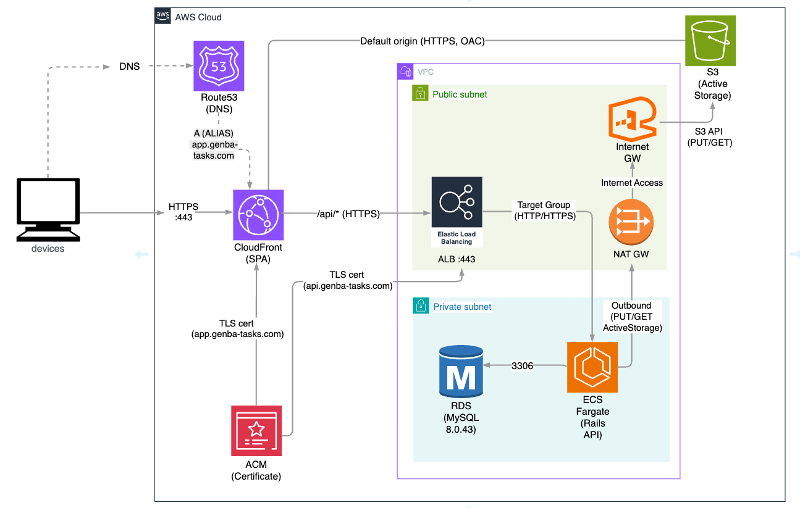

# Genba Tasks (SPA) 

> 施工管理の**現場段取りを見える化**し、タスクを**細分化**して**優先順位**を明快にする。  
> 現場ごとの**絞り込み**で「今やるべき」を失わない、現場×PC向けのタスク管理アプリ。

- アプリ: https://app.genba-tasks.com/
- 体験方法: **ゲストログイン**（ワンクリック入場 / メール登録不要）

---

## 目次
- [Genba Tasks (SPA)](#genba-tasks-spa)
  - [目次](#目次)
  - [機能](#機能)
    - [認証](#認証)
    - [タスク管理](#タスク管理)
    - [ヒーローセクション](#ヒーローセクション)
    - [機能ハイライト](#機能ハイライト)
    - [タスクの基本操作（CRUD）](#タスクの基本操作crud)
    - [子タスク上限](#子タスク上限)
  - [画像バリデーション](#画像バリデーション)
    - [タスク詳細ドロワー](#タスク詳細ドロワー)
    - [親タスクの並び替え（子は対象外）](#親タスクの並び替え子は対象外)
    - [優先タスクパネル](#優先タスクパネル)
  - [絞り込み \& 並び替え](#絞り込み--並び替え)
  - [技術スタック / バージョン](#技術スタック--バージョン)
  - [インフラ構成図](#インフラ構成図)
  - [使い方（デモ手順）](#使い方デモ手順)
  - [リポジトリ構成](#リポジトリ構成)
  - [ローカル実行](#ローカル実行)
  - [CORS 設定（Rails）](#cors-設定rails)
  - [テスト / 品質](#テスト--品質)
    - [RSpec（モデル／リクエスト）](#rspecモデルリクエスト)
    - [Playwright（E2E）](#playwrighte2e)
  - [ER 図](#er-図)
  - [既知の制限](#既知の制限)
  - [ライセンス](#ライセンス)

---

## 機能

### 認証
- ログイン / ログアウト（**devise_token_auth** によるトークン認証）
- ユーザー登録 / 表示 / 更新 / 削除
- パスワード再設定（本番は SES/SMTP に切替可能）
- **ゲストログイン（ワンクリック）**

### タスク管理
- **親子タスクの CRUD**：深さ **無制限**、**子は各親につき最大4つ**
- **並び替え（ドラッグ＆ドロップ）**：**親タスクのみ可能**（子タスクは不可）／**フィルタ中もDnD可**
- **画像添付**：**親のみ1枚**、**jpeg/png/webp/gif**、**≤5MB**、置換可
- **検索/絞り込み/並び替え**：
  - 絞り込み：**現場名**検索、**進捗状況**（未着手・進行中・完了）、**上位タスクのみ**表示
  - 並び替え：**期限 / 進捗% / 作成日**（昇順・降順）
- **対応ブラウザ**：**PCのみ**

---

### ヒーローセクション


### 機能ハイライト


### タスクの基本操作（CRUD）


### 子タスク上限
親タスクごとに**最大 4 件**。5件目は作成できません（＋が無効）。  


---

## 画像バリデーション

- **非画像**を選ぶとエラー表示  
  

- **5MB超**を選ぶとエラー表示  
  

**許可形式**: jpeg / png / webp / gif  
**サイズ上限**: 5MB

### タスク詳細ドロワー


### 親タスクの並び替え（子は対象外）


### 優先タスクパネル
完了トグルで該当行が即時にリストから消えます。  


## 絞り込み & 並び替え


---

## 技術スタック / バージョン
- **Frontend**：React **18.3.1** / TypeScript **5.9.2** / Vite / React Router / Axios  
- **Backend**：Ruby **3.2.3** / Rails **8.0.2** / Devise / Devise Token Auth / rack-cors / Active Storage (+ S3)  
- **Infra**：AWS（**ECS Fargate**, **ALB**(ACM), Route53, **RDS**(MySQL **8.0.43**), **S3**）
- **Node / pnpm**：Node **v24.2.0** / pnpm **10.17.0**

---

## インフラ構成図


本番環境は AWS 上で構築しています。

- **フロントエンド (React SPA)**  
  - S3 に静的ファイルを配置し、CloudFront (OAC) 経由で配信  
  - Route53 で `app.genba-tasks.com` を独自ドメインとして解決  
  - ACM により TLS 証明書を発行し、HTTPS 通信を実現  

- **バックエンド (Rails API)**  
  - CloudFront → ALB(443) → ECS(Fargate) → RDS(MySQL) の構成  
  - Route53 で `api.genba-tasks.com` を解決し、CloudFront 経由で API リクエストを ALB にルーティング  
  - ACM により API 側も HTTPS 化  

- **画像アップロード (Active Storage)**  
  - API サーバ (ECS) は Private Subnet に配置  
  - 直接 S3 には出られないため、NAT Gateway → Internet Gateway を経由して S3 API(HTTPS) へアクセス  
  - これによりセキュリティを担保しつつ Active Storage で画像の PUT/GET が可能  

- **セキュリティ / 運用設計**  
  - フロントは CloudFront (OAC) 経由でのみ S3 バケットにアクセスできるよう制限（直アクセス禁止）  
  - バックエンドは Private Subnet に隔離し、外部から直接アクセスできない設計  
  - すべての通信を HTTPS/TLS 経由に統一し、安全な通信を実現  

> この構成により「静的コンテンツの高速配信」「API サーバのセキュリティ確保」「HTTPS による暗号化通信」「S3 の安全な利用 (OAC/NAT 経由)」を実現しています。


---

## 使い方（デモ手順）
1. https://app.genba-tasks.com を開く  
2. 右上の **「ゲストユーザーで試す」** で入場  
3. 上部フォームから **親タスクを作成**（現場名は必須）  
4. 親タスクの編集で **画像を添付**（S3に保存 → サムネ表示）  
5. ボード上で **親タスクをドラッグ＆ドロップ**して順序変更

---

## リポジトリ構成

```

/frontend   # React + Vite (SPA)
/backend    # Rails API (Devise Token Auth, Active Storage)
/infra      # IaC/運用スクリプト（最小）
/docs/screens/readme-assets  # README 用の画像・GIF

````

---

## ローカル実行

**Backend**
```bash
cd backend
bundle install
bin/rails db:setup
bin/rails s   # http://localhost:3000
````

**Frontend**

```bash
cd frontend
pnpm install
# .env.local
VITE_API_BASE_URL=http://localhost:3000
pnpm dev      # http://localhost:5173
```

> Docker Compose 版がある場合は別途記載。現状は手動手順を最短として提示。

---

## CORS 設定（Rails）

```rb
# config/initializers/cors.rb
Rails.application.config.middleware.insert_before 0, Rack::Cors do
  allow do
    origins 'https://app.genba-tasks.com'
    resource '*',
      headers: :any,
      expose: %w[access-token client uid expiry token-type],
      methods: %i[get post put patch delete options head],
      credentials: false
  end
end
```

---

## テスト / 品質

> 実行コマンド 
> **API**: `RAILS_ENV=test bundle exec rspec`  
> **E2E**: `pnpm test:e2e`（Playwright／`tests/.auth` を利用）

### RSpec（モデル／リクエスト）

- **認可 / セキュリティ**
  - 未ログインアクセスは `401/403`
  - 他人のタスク更新は **404/403**
- **業務ルール**
  - 親のみ **site 必須**（子は不要）
  - **子上限＝各親4件**（5件目は invalid／親付け替えでも invalid）
  - **階層は4まで**（5階層目は `422/invalid`）
  - **子 progress 更新 → 親は平均で自動更新**
- **一覧・優先順・補助エンドポイント**
  - `deadline:asc` は **NULLS LAST**（期限あり→期限なし）
  - `progress_min/max` 範囲フィルタ
  - `status` は **文字列/数値の両方**を受け付け
  - `parents_only=1` で **親のみ**返す
  - `/api/tasks/priority` は **自分のタスクのみ**を優先順で返す
  - `/api/tasks/sites` は **親タスクの site を distinct + 並び替え**で返す
- **画像アップロード（Active Storage）**
  - 親のみ添付/置換OK → **URL/サムネURL返却**
  - **子は常に 422**、**非画像は 422**
- **ヘルスチェック**
  - `GET /up` が認証不要で `200`、`{ status, app, sha, rails_env, time, db }` を返す

### Playwright（E2E）

- **認証フロー**
  - 未ログインで `/tasks` → `/login` リダイレクト
  - 正常ログインで `/tasks` 到達
  - セッション破棄で `/login` に戻る
- **D&D（並び替え）**
  - **ハンドル以外**からは drag 開始しない
  - **子タスクはドラッグ不可**（ハンドル非表示・順序不変）
  - 親タスクは **after 仕様**で並び替え可（UI反映を確認）
  - **親またぎ reorder は 422**（APIガード）
- **画像UI**
  - 親：**添付 → 表示 → 置換 → 削除** → リロードしても状態一致
  - 子：画像UIなし（または disabled）
  - **非画像 / 5MB超**はバリデーション表示
- **UIガード**
  - 親に子があると **削除不可**（**DELETE がネットワーク送出されない**ことを確認）
- **フィルタ & 並び替え**
  - フィルタバーの **URLクエリ同期**（`site/order_by/dir`）
  - 進捗 **20–80%** の範囲絞り込み、**境界値** `min=max=50` で50%のみ
  - **ステータス複数選択**で絞り込み（未着手/進行中/完了）
- **作成・編集系**
  - 上位タスク作成ボックスで **親を新規作成**
  - 期限入力を保存すると **`yyyy-mm-dd` 表示**
  - 親の ▾/▸ で **子の開閉**
  - **親は青バー／子はチェック先頭**・完了で **取り消し線**・期限表示

> ストレージ：`tests/.auth/storage.json` / `tests/.auth/e2e.json` を利用し、DTAトークン（`access-token/client/uid`）をローカルストレージへ注入して安定実行。

---

## ER 図


> **Status enum:** `0=todo / 1=doing / 2=done`

<details>
<summary>Mermaid ソース（参考・描画しません）</summary>

```text
erDiagram
  USERS ||--o{ TASKS : "has many"
  TASKS ||--o{ TASKS : "self (parent_id)"
  TASKS ||--o{ ACTIVE_STORAGE_ATTACHMENTS : "images"
  ACTIVE_STORAGE_ATTACHMENTS }|--|| ACTIVE_STORAGE_BLOBS : "blob"

  USERS {
    bigint id
    string email
    string name
    datetime created_at
    datetime updated_at
  }

  TASKS {
    bigint id
    string title
    int status
    float progress
    datetime deadline
    string site
    int depth
    int position
    bigint user_id
    bigint parent_id
    datetime created_at
    datetime updated_at
  }

  ACTIVE_STORAGE_ATTACHMENTS {
    bigint id
    string name
    string record_type
    bigint record_id
    bigint blob_id
    datetime created_at
  }

  ACTIVE_STORAGE_BLOBS {
    bigint id
    string filename
    string content_type
    bigint byte_size
    datetime created_at
  }
```

</details>

---

## 既知の制限

* **既知の制限**

  * **DnDは上位タスクのみ**（サブタスクは不可）
  * **子タスクは各親につき最大4つ**
  * **階層は最大4**（5階層目は作成不可）
  * **画像は親のみ1枚**（≤5MB、jpeg/png/webp/gif）／**複数枚・非画像添付は不可**
  * **PC向けUI**（モバイル・PWA未対応）
  * **フリーテキスト検索なし**（絞り込みは site / status / progress / 期限 のみ）
  * **ページネーションなし**（一覧は全件取得想定）
  * **共同編集・共有なし**（ボード共有／ロール・権限は未実装）
  * **通知機能なし**（期限メール／Push未実装）
  * **認証まわり**：SSO/2FAなし、デモ環境ではメール送信無効
  * **アクセシビリティは最小限**（キーボード操作は一部対応、スクリーンリーダ最適化は未対応）
  * **オフライン未対応**（キャッシュ戦略・楽観的更新なし）
  * **監査/運用**：監査ログ・操作履歴なし、レートリミット／WAF未導入
  * **インポート/エクスポートなし**（CSV/Excel連携未実装）
  * **画像CDN最適化未導入**

---

## ライセンス

MIT